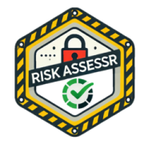

# risk.assessr

<a></a>

<!-- badges: start -->


<!-- badges: end -->


## Overview

`risk.assessr` helps in the initial determining of a package's reliability and security in terms of maintenance, documentation, and dependencies. This package is designed to carry out a risk assessment of R packages at the beginning of the validation process (either internal or open source). It calculates risk metrics such as:

- **Core metrics** - includes R command check, unit test coverage and composite coverage of dependencies

- **Documentation metrics** - availability of vignettes, news tracking, example(s), check if functions have family documentation, return object description for exported functions, and type of license

- **Dependency Metrics** - package dependencies and reverse dependencies

- **Traceability matrix** - matching the function / test descriptions to tests and match to test pass/fail

## How it works

This package executes the following tasks:

1. Download the source package(`tar.gz` file)

2. Unpack the `tar.gz` file

3. Install the package locally

4. Run code coverage

5. Run a traceability matrix

6. Run R CMD check

7. Run risk assessment metrics using default or user defined weighting


## Installation

Install from GitHub:

```r
remotes::install_github("Sanofi-Public/risk.assessr")
```

Or from CRAN, when published:

```r
install.packages("risk.assessr")
```

## Usage

To assess your package, do the following steps:

1. Build your package as a `tar.gz` file

2. Set repository options

3. Run the following code sample by loading or add path parameter to your `tar.gz` package source code


``` r
options(repos = c(
  RSPM = "https://cloud.r-project.org",
  INTERNAL = "https://cloud.r-project.org",
  INTERNAL_RSPM = "https://cloud.r-project.org"
))

library(risk.assessr)

# using build package
# Local package source tarball (path or interactive file chooser)
results <- risk_assess_pkg("path/to/your/package.tar.gz")
results <- risk_assess_pkg()  # opens file chooser

# Package by name from CRAN/Bioconductor/internal
results <- risk_assess_pkg(package = "dplyr")
results <- risk_assess_pkg(package = "dplyr", version = "1.0.0")

# Lock file (renv.lock or pak.lock)
results <- risk_assess_pkg_lock_files("path/to/your/lockfile")
```

Note: This process can be very time-consuming and is recommended to be performed as a batch job or within a GitHub Action.


## Metrics and Risk assessment

| Key Metrics | Reason | where to find them in Metrics and Risk assessment | 
| -------------| ---------|----------------------|
| RCMD check  | series of 45 package checks of tests, package structure, documentation | `check` element in `results` list, check_list |
| test coverage | unit test coverage | `covr` element in `results` list, covr_list |
| risk analysis | rules and thresholds to identify risks | risk_analysis |
| traceability matrix| maps exported functions to test coverage, documentation by risk and function type| tm_list |


## Publication/presentation

1. **Conference:** Connect 2025  
   **Location:** Orlando, US  
   **Session ID:** OS17  
   **Title:** *Risk.assessr: A Tool for Assessing and Mitigating Risks with Open-Source R Packages in Clinical Trials*  
   **Presenters:** Andre Couturier, Edward Gillian  
   **Authors:** Edward Gillian, Hugo Bottois, Paulin Charliquart, Andre Couturier  
   **Company:** Sanofi  
   **Materials**  
   - [Presentation (PDF)](https://phuse.s3.eu-central-1.amazonaws.com/Archive/2025/Connect/US/Orlando/PRE_OS17.pdf)  
   - [Paper (PDF)](https://phuse.s3.eu-central-1.amazonaws.com/Archive/2025/Connect/US/Orlando/PAP_OS17.pdf)

2. **Conference:** PHUSE SDE 2025  
   **Location:** Beijing, China  
   **Title:** *CI/CD in R Package Development with Integrated Risk Assessment*  
   **Presenter:** Neo Yang  
   **Authors:** Edward Gillian, Hugo Bottois, Paulin Charliquart, Andre Couturier  
   **Company:** Sanofi  
   **Materials**  
   - [Presentation (PDF)](https://phuse.s3.eu-central-1.amazonaws.com/Archive/2025/SDE/APAC/Beijing/PRE_Beijing07.pdf)

3. **Conference:** EU Connect 2025  
   **Location:** Hamburg, Germany  
   **Session ID:** CT10  
   **Title:** *Risk.assessr: Extracting OOP Function Details*  
   **Presenter:** Edward Gillian  
   **Authors:** Edward Gillian, Hugo Bottois, Paulin Charliquart, Andre Couturier    
   **Company:** Sanofi  
   **Materials / Status:**  
   - *Ongoing*

4. **Conference:** R/Pharma 2025 APAC  
   **Location:** Online    
   **Session ID:** Ongoing   
   **Title:** *risk.assessr:  extending its use in the package validation process*   
   **Presenter:** Hugo Bottois  
   **Authors:** Edward Gillian, Hugo Bottois, Paulin Charliquart, Andre Couturier  
   **Company:** Sanofi  
   **Materials / Status:**    
   - *Ongoing*


## Citation

Gillian E, Bottois H, Charliquart P, Couturier A (2025). risk.assessr: Assessing Package Risk Metrics. R package version 2.0.0, <https://sanofi-public.github.io/risk.assessr/>.

```         
@Manual{,
  title = {risk.assessr: Assessing Package Risk Metrics},
  author = {Edward Gillian and Hugo Bottois and Paulin Charliquart and Andre Couturier},
  year = {2025},
  note = {R package version 2.0.0},
  url = {https://sanofi-public.github.io/risk.assessr/},
}
```

## Acknowledgements

The project is inspired by the [`riskmetric`](https://github.com/pharmaR/riskmetric) package and the [`mpn.scorecard`](https://github.com/metrumresearchgroup/mpn.scorecard) package and draws on some of their ideas and functions.